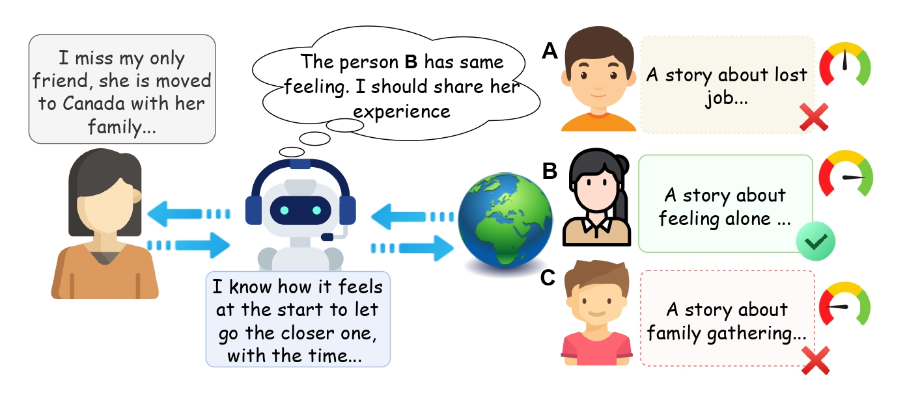

# Can Machines Resonate with Humans? Evaluating the Emotional and Empathic Comprehension of LMs [EMNLP 2024]

> [**Empathic Comprehension of LMs**](https://arxiv.org/abs/2406.11250)<br>
> [Muhammad Arslan Manzoor](https://scholar.google.com/citations?user=ZvXClnUAAAAJ&hl=en), [Yuxia Wang](https://scholar.google.com.au/citations?hl=en&user=dciz7yMAAAAJ&view_op=list_works&sortby=pubdate), 
[Minghan Wang](https://scholar.google.com/citations?user=F6nm6awAAAAJ&hl=en), [Preslav Nakov](https://scholar.google.com/citations?user=DfXsKZ4AAAAJ&hl=en)

<h2 style="margin-bottom: 0.2em;">Overview</h2>
<h4 style="margin-bottom: 0.1em;">Background:</h4>
<ul>
  <li>LMs are primarily trained for semantic understanding tasks.</li>
  <li>Objective functions are designed to focus on semantic learning.</li>
</ul>
<h4 style="margin-bottom: 0.1em;">Motivation:</h4>
<ul>
  <li>Equip LMs with enhanced emotional and empathy aspects for better resonance with humans.</li>
</ul>
<h4 style="margin-bottom: 0.1em;">Hypothesis:</h4>
<ul>
  <li>Tasks of semantic textual similarity (STS) and NLI are used to improve semantic embeddings. Can the task of empathic similarity between two narratives improve the empathy of models?</li>
</ul>


## Highlights


> **<p align="justify"> Abstract:** *Empathy plays a pivotal role in fostering prosocial behavior, often triggered by the sharing of personal experiences through narratives. However, modeling empathy using NLP approaches remains challenging due to its deep interconnection with human interaction dynamics. Previous approaches, which involve fine-tuning language models (LMs) on human-annotated empathic datasets, have had limited success. In our pursuit of improving empathy understanding in LMs, we propose several strategies, including contrastive learning with masked LMs and supervised fine-tuning with large language models. While these methods show improvements over previous methods, the overall results remain unsatisfactory. To better understand this trend, we performed an analysis which reveals a low agreement among annotators. This lack of consensus hinders training and highlights the subjective nature of the task. We also explore the cultural impact on annotations. To study this, we meticulously collected story pairs in Urdu language and find that subjectivity in interpreting empathy among annotators appears to be independent of cultural background. Our systematic exploration of LMs' understanding of empathy reveals substantial opportunities for further investigation in both task formulation and modeling..* </p>

## Main Contributions

1) **Enhancing Empathic Similarity:** We explore various approaches to improve empathic similarity estimation, including the use of contrastive loss in LMs, reasoning and fine-tuning of LLMs.
2) **Examining Subjectivity in Empathic Similarity Judgments:** Our analysis of model prediction alignment with human labels reveals significant disagreement among annotators, underscoring the subjective nature of empathic similarity assessment.
3) **Exploring Language and Cultural Impact with an Urdu Dataset:** We collect a new Urdu dataset to investigate the impact of language and culture on empathic labeling.

## Task 

Empathic similarity is the task is to measure the similarity between two narratives by a numerical score in the range of 1 to 4. 1 represents totally dissimilar and 4 indicates extremely similar. The task can be describe to:
- Assess how much narrators would empathize with one another, where main event, emotion, and moral are core influencing features to asses it.

## Dataset

We reproduce baseline experiments, performed error analysis and evaluated proposed strategies to enhance empathic comprehesion of Language Models on [EmpathicStories](https://github.com/mitmedialab/empathic-stories) dataset. The detailed overview of dataset is available at repository of [EmpathicStories](https://github.com/mitmedialab/empathic-stories/blob/main/README.md). The brief description is following:

### [EmpathicStories](https://github.com/mitmedialab/empathic-stories) English Dataset:
- 1500 Pairs of English stories (train: 1000, dev: 400, test: 100).
- Annotated as event, emotion, moral, and empathy similarity of each pair.

### Urdu Empathic Similarity Dataset:

- 300 Pairs of Urdu stories synthetically generated with GPT4o and annotated by human.
- Annotated as event, emotion, and empathy similarity of each pair (we removed moral from annotation due to its abstract nature).

## Language Models


## File Structure
* `/data` contains all data folders
    * `/EmpathicStories` contains data folders for train, dev, test sets for English EmpathicStories
    * `/UrduData` contains all data file for EmpathicStories in Romanized Urdu
        * `cleaned_urdu_stories.csv` contains the pairwise stories e.g. story_A, story_B,	Similarity_score,	Theme_story_A, Theme_story_B,	Reason which we used to evaluate LMs
         * `urdu_story_pair.json` 9 pairs collected during testing
         * `urdu_story_pair.jsonl` uncleaned Urdu pairs in json format
         * `Urdu_Dataset_Annotation.csv` contains annotation score w.r.t each annotator. However the important fields to evaluate models are Event_AVG,	Emo_AVG, and Emp_AVG, which are the average of 4 annotators. The gpt_score is the same score that GPT4o provided while generating dataset.
* `/ErrorAnalysis` contains the scores we achieved while reproducing the results on EmpathicStories with SBERT and BART 

* `/Notebooks` contains ...

* `/Scripts` contains ...

## Results


## Citation

If you use our work, please consider citing:
``` bibtex
@article{manzoor2024can,
  title={Can Machines Resonate with Humans? Evaluating the Emotional and Empathic Comprehension of LMs},
  author={Manzoor, Muhammad Arslan and Wang, Yuxia and Wang, Minghan and Nakov, Preslav},
  journal={arXiv preprint arXiv:2406.11250},
  year={2024}
}
```